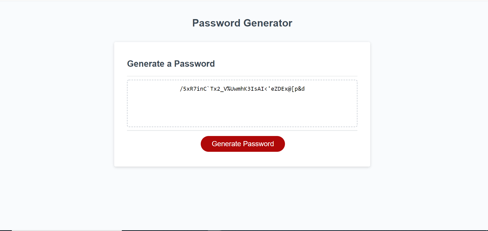

# :lock_with_ink_pen: The Password Generator Challenge :lock_with_ink_pen:

## Overview :book:
For this challenge I was assigned to refactor a password generator that can adapt to multiple interfaces and browers.  The password generator features HTML, CSS and powered by Javascript.


### User Story :notebook_with_decorative_cover:
```
AS AN employee with access to sensitive data
I WANT to randomly generate a password that meets certain criteria
SO THAT I can create a strong password that provides greater security
```

### Client's Acceptance Criteria :pencil2:
```
GIVEN I need a new, secure password
WHEN I click the button to generate a password
THEN I am presented with a series of prompts for password criteria
WHEN prompted for password criteria
THEN I select which criteria to include in the password
WHEN prompted for the length of the password
THEN I choose a length of at least 8 characters and no more than 128 characters
WHEN asked for character types to include in the password
THEN I confirm whether or not to include lowercase, uppercase, numeric, and/or special characters
WHEN I answer each prompt
THEN my input should be validated and at least one character type should be selected
WHEN all prompts are answered
THEN a password is generated that matches the selected criteria
WHEN the password is generated
THEN the password is either displayed in an alert or written to the page
```

---
## Features

* Responsive Web Design (RWD)
* Interactive links
* Enhanced attributes for webpage accessibility 

---

## :link: Link to Webpage

Click the following link to visit the webpage:

[A live link to the webpage](https://adorsey5.github.io/revise-the-sunrise/)


The following image is a screenshot of the webpage:



---
## :capital_abcd:Languages and Technology Used :computer:

### Languages
* HTML
* CSS
* Javascript


### Technology

* VSCode
* GitBash
* Emojis from "Markdown Emoji" VSCode extension *

---

## Acknowledgments

For my third challenge I had a great deal of guidance from:

 * UM Coding Bootcamp Modules/GitLab Respository
 * UM Coding Bootcamp instructor and teacher assistants (TAs)
 * UM Coding Bootcamp Tutor: Jeremy Jones
 * UM Coding Bootcamp Classmates
 * Google

 ---

- - -
© 2022 Asha Dorsey
